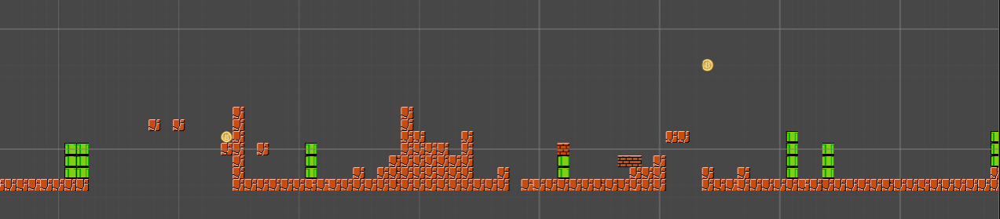
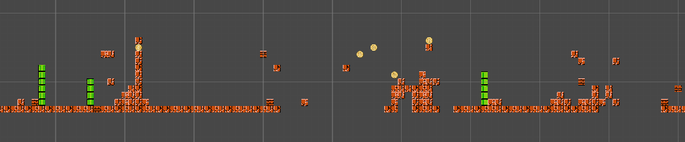

# MARIO DEEP LEARNING LEVEL GENERATOR
This is an lstm trained to generate Super Mario Levels

## How to Run
1. To Train
```
python train.py
```
2. To train from checkpoints
```
python train.py --model_checkpoint <my checkpoint>
```
3. make sure you have the "character_data.pickle" and "model.mod", then
```
python generate_test.py
```


## Examples
</br>

</br>

## THANKS TO
The videogame Level corpus for the Mario levels for training</br>
https://github.com/TheVGLC/TheVGLC</br>
My Friend Guinxu </br>
https://www.youtube.com/user/GuinxuVideos
